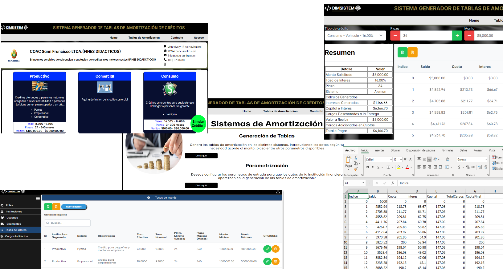
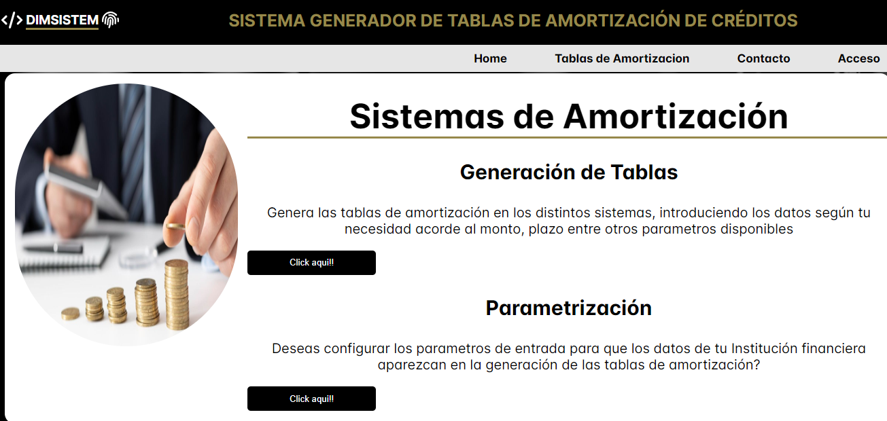
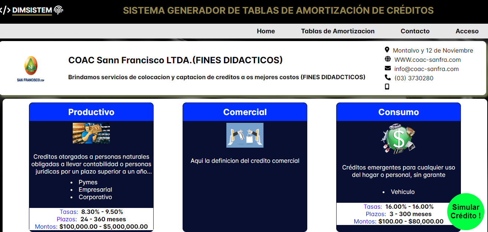
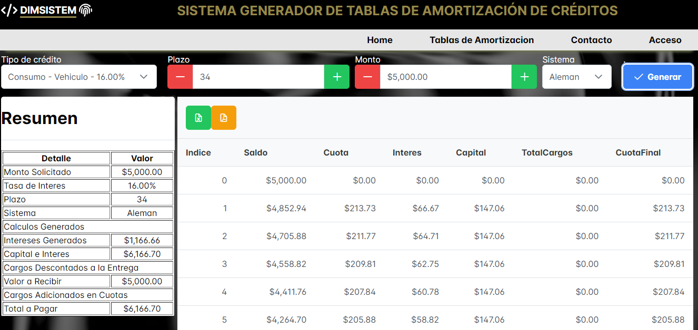
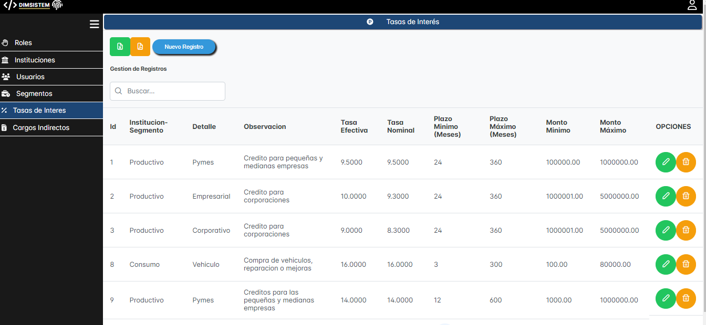
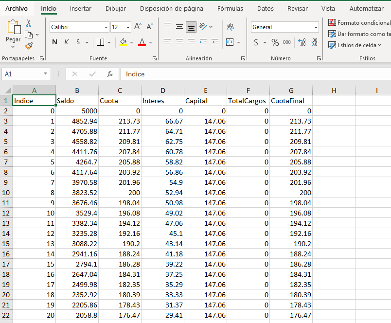

# Sistema de Gestón de Tablas de Amortización
La app es multiinstitucional, por lo que permite configurar los datos de varias instituciones financieras quienes pueden configurar sus grupos, segentos, tasas, servicios y demas relacionados a sus creditos ofrecidos.

## Tecnologías utilizadas

- Angular 16
- Laravel 10
- PrimeNG
- Fontawesome

## Características

### Aplicación cliente Final:
 - Acceso a la plataforma de forma sencilla y sin claves donde podrá seleccionando los parametros como institución, tipo de credito y digitando los montos, plazos y tipo de tasa; generar la tabla de amortización en base a los parámetros ingresados.

### Aplicación cliente Insitución:
-  Permite configurar los datos de varias instituciones financieras quienes pueden configurar sus grupos, segentos, tasas, servicios y demas relacionados a sus creditos ofrecidos.

### Tipos de sistemas:
- La app se desarrollo con Angular y Laravel, para la BD se utilizó MariaDB

## Instalación y ejecución
-Para poder correr esta aplicaion es necesario tener instala flutter, dart, Angular.
- Pasos:
1. Clona o descarga este repositorio en tu máquina local.
  Aplicación Web
-. Abre el proyecto en tu editor texto preferido .
-. Ejecuta el proyecto de angular

## Contribución

Si deseas contribuir a este proyecto, sigue estos pasos:

1. Haz un fork de este repositorio.
2. Crea una rama con un nombre descriptivo: `git checkout -b nombre-de-la-rama`.
3. Realiza tus cambios y guarda los archivos modificados.
4. Haz commit de tus cambios: `git commit -m 'Descripción de los cambios'`.
5. Envía tus cambios al repositorio remoto: `git push origin nombre-de-la-rama`.
6. Abre una solicitud de extracción en GitHub y describe tus cambios en detalle.

